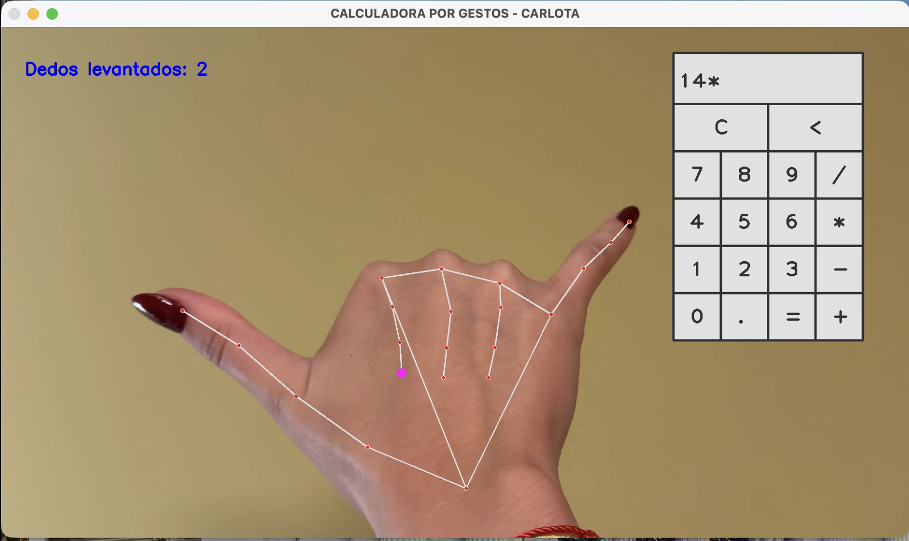

# Calculadora Basada en Gestos — Práctica 1

**Universidad:** Universidad Intercontinental de la Empresa
**Asignatura:** Sistemas Inteligentes Interactivos
**Autora:** Carlota Fernández del Riego  
**Profesor:** David Rivas Villar  
**Fecha:** 14 Octubre 2025  

---

## Objetivo de la práctica

Diseñar e implementar una **calculadora controlada mediante gestos**, utilizando la **cámara web** y técnicas de **visión por computador**.  
El sistema debe detectar la mano del usuario mediante **MediaPipe Hands** y permitir realizar operaciones básicas como son la suma, la resta, la multiplicación, la división y el borrado **sin tocar el teclado**, solo con gestos o manteniendo el dedo índice sobre los botones virtuales. Además, el sistema debe tener en cuenta la posición y la orientación de los dedos para detectarlos a través de la cámara y traducirlos a una acción.

---

## Tecnologías empleadas

Para poder realizar esta práctica se han necesitado tecnologías como:

- **Python 3.10+**
- [OpenCV](https://opencv.org/) para la interfaz visual y control de cámara  
- [MediaPipe Hands](https://developers.google.com/mediapipe) para la detección y el seguimiento de las manos  
- [Docker](https://www.docker.com/) + Makefile para el entorno reproducible  
- **time** (módulo de Python) para el control de la estabilidad y el tiempo de espera  

---

## Ejecución del proyecto

### 1. Requisitos previos
Instalar las dependencias (para ello se puede usar el archivo `requirements.txt`): pip install -r requirements.txt

### 2. Verificación del funcionamiento de la cámara
Antes de iniciar la calculadora, es recomendable probar que la cámara funciona correctamente ejecutando el código `webcam_test.py`
    *Nota: para los usuarios de Mac es probable que se deba usar la cámara 0, cap = cv2.VideoCapture(0), y eliminar la línea `gpus all` del archivo `Makefile`*
Si se ve la imagen de la cámara en una ventana llamada “Video2 Full HD”, se puede continuar con la ejecución del programa principal.

### 3. Ejecución de la Calculadora por Gestos
Ejecuta el script principal desde la terminal con el comando python calculadora_gestos.py
    *RECUERDA: Si tu cámara no se abre, cambia el índice en la línea cap = cv2.VideoCapture(0) por cap = cv2.VideoCapture(1) o cap = cv2.VideoCapture(2) según tu dispositivo.*

### 4. Control por gestos
Una vez abierta la ventana de la cámara, MediaPipe detectará tu mano y podrás usar los siguientes gestos para usar la calculadora:

| Gesto             | Acción                             |
|-------------------|------------------------------------|
| Puño cerrado      | Borrar toda la operación           |
| Solo índice       | Seleccionar botón (3s de espera)   |
| Índice + corazón  | Insertar número “2”                |
| Índice + meñique  | Insertar signo “+”                 |
| Pulgar + meñique  | Insertar signo “*”                 |
| Cuatro dedos      | Insertar signo “-”                 |
| Cinco dedos       | Insertar número “5”                |
| Pulgar arriba     | Calcular resultado (=)             |

Pulsa `q` para salir del programa.

### 5. Ejemplo de uso del programa
1. Escribe en la terminal `python calculadora_gestos.py`,recuerda estar siempre en la ruta correcta del programa (`cd + ruta del archivo`)
2. Apunta con el dedo índice al número deseado.
3. Usa el gesto correspondiente para sumar, restar o multiplicar.
4. Levanta el pulgar para calcular el resultado.
5. El resultado se mostrará en la pantalla de la calculadora.

---

### Funcionamiento general

El sistema:
1. Se inicia la cámara y se detecta la mano del usuario.
2. El sistema interpreta la posición de los dedos mediante **MediaPipe Hands**, que identifica los 21 puntos de referencia de la mano.
3. Se traducen los patrones de los dedos levantados a **gestos predefinidos** asignando una acción a cada combinación.
4. Se muestra en pantalla una **calculadora virtual** con botones renderizados en tiempo real con OpenCV.
5. Se permiten escribir números y operaciones mediante **gestos específicos** o apuntando con el dedo índice sobre los botones durante 3 segundos.
6. Finalmente, se evalúa la operación matemática con el gesto de *pulgar hacia arriba* o manteniendo el dedo índice sobre el botón = en la pantalla.

---

### Interfaz

La interfaz está completamente construida con **OpenCV**, dibujando en tiempo real tanto los botones de la calculadora como los textos informativos.
- En la esquina derecha se representa la zona de la calculadora con botones de color blanco y bordes definidos.
- En la parte superior de dicha zona se muestra una ventana blanca donde aparece la operación actual y el resultado.
- En la pantalla se visualiza la mano detectada con sus puntos de referencia y conexiones, generados por MediaPipe.
- El usuario puede ver en todo momento el número de dedos levantados, los botones resaltados al apuntar con el dedo índice, y los mensajes de estado como “BORRANDO…”.

Todo el renderizado ocurre en tiempo real, permitiendo una experiencia fluida y visualmente intuitiva.

---

### Lógica del sistema

El funcionamiento interno se basa en tres bloques principales:

1. Detección de mano: Utiliza `mp.solutions.hands.Hands()` para procesar cada fotograma y obtener la posición de los 21 landmarks de la mano. Con estos datos, se determina qué dedos están levantados comparando sus coordenadas.

2. Interpretación de gestos: Se define una función `fingers_up()` que analiza la posición de los dedos y devuelve cuántos están extendidos. Cada patrón se asocia a una acción concreta y el dedo índice se usa como puntero para interactuar con los botones de la calculadora.

3. Renderizado y cálculo: Los botones se definen mediante una clase `Button`, que gestiona su posición, tamaño, valor y aspecto visual. Cada vez que el dedo índice se mantiene sobre un botón durante 3 segundos, se añade su valor a la operación actual, y cuando se detecta el gesto de cálculo, se evalúa la operación con `eval()` y se muestra el resultado en pantalla.

---

### Estructura del proyecto

P1-GEST-CALC/
├─ README.md
├─ requirements.txt
├─ Makefile
├─ Dockerfile
├─ vista_previa/
│  └─ captura.png
└─ src/gest_calc/
      ├─ sample_main.py
      └─ webcam_test.py

---

### Vista previa

Durante la ejecución se puede observar:
- El marco de la cámara con los puntos de la mano detectados.
- Los botones de la calculadora renderizados a la derecha.
- La operación actual y los mensajes de estado dinámicos (“BORRANDO…”, “CALCULANDO…”).

* Para poder visualizar el funcionamiento del sistema a través de un vídeo se debe acceder a este enlace: 
https://drive.google.com/drive/folders/1P9AiL6KSaTIPeYBJPArhTvcLBKOmr5ny?usp=sharing

